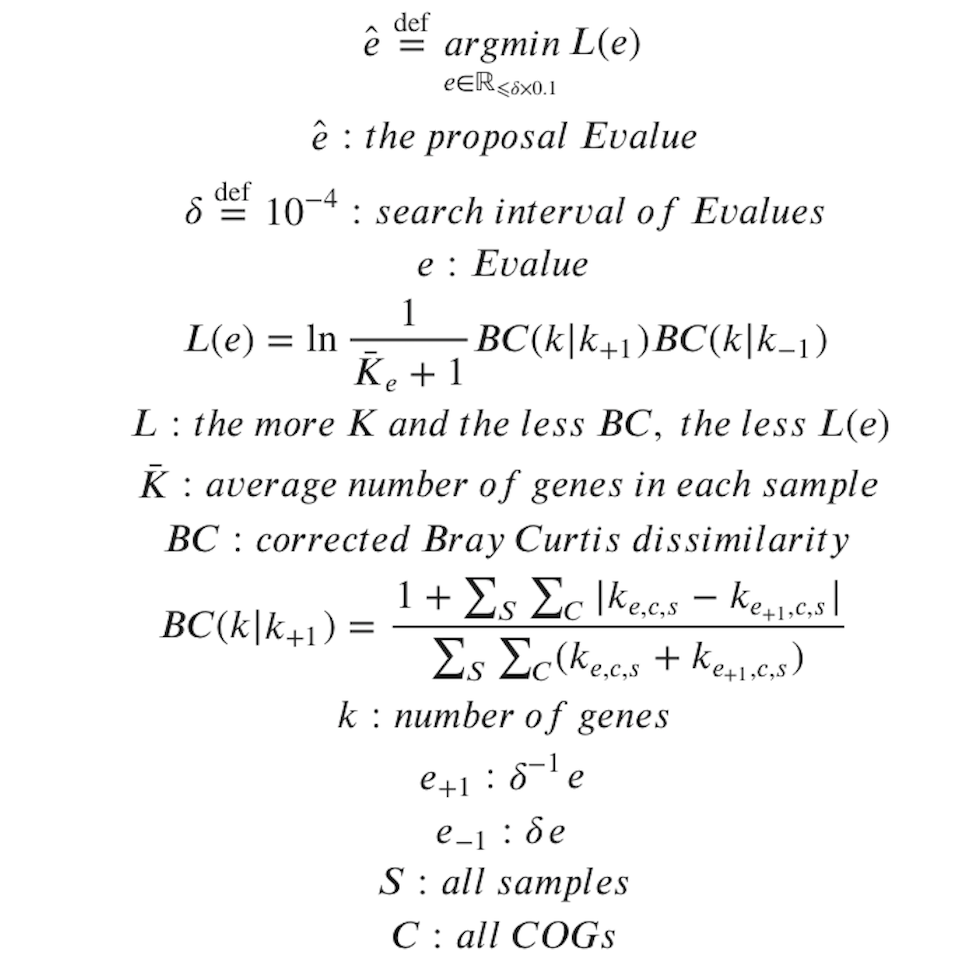
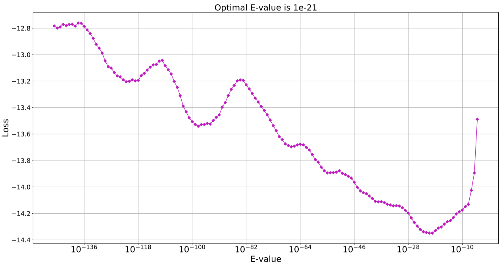
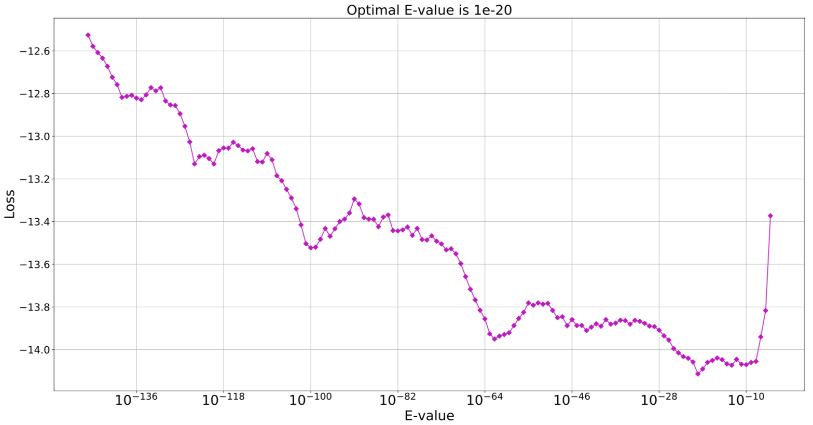
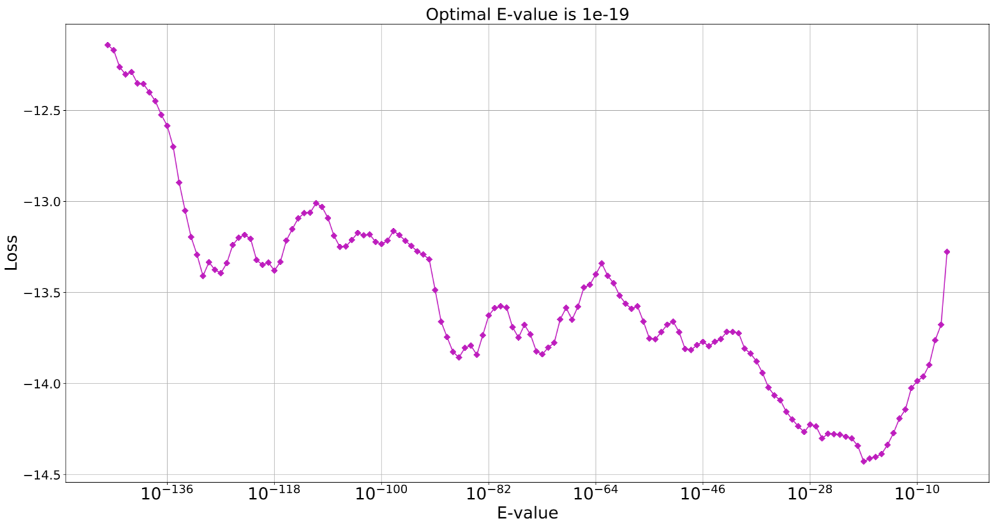
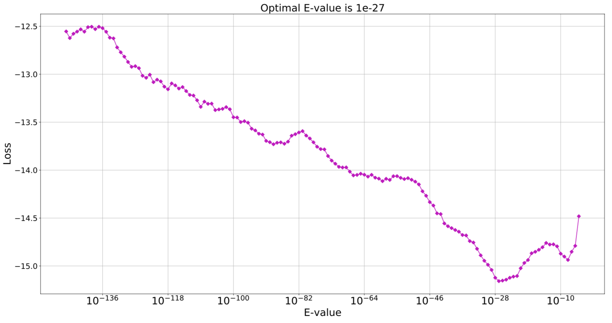

# COGplot
**dependency**
- matplotlib-venn  

## Installation
```
$ pip install matplotlib-venn
$ git clone https://github.com/dkato2021/COGplot.git
$ chmod u+x *.py
```
## Usage
```
$ Lossplot.py -AA gene1.fasta gene2.fasta ...
$ COGplot.py -AA gene1.fasta gene2.fasta ...
```

## tips
```
$ COGplot.py -AA ./X/* ./Y/* -e 1e-4 1e-12 1e-20
```
## How to determine the Evalue










## How to detect unique genes

## How to interpret the PCA diagram

Reference
- https://statistics.co.jp/reference/software_R/statR_9_principal.pdf
## Output Example


