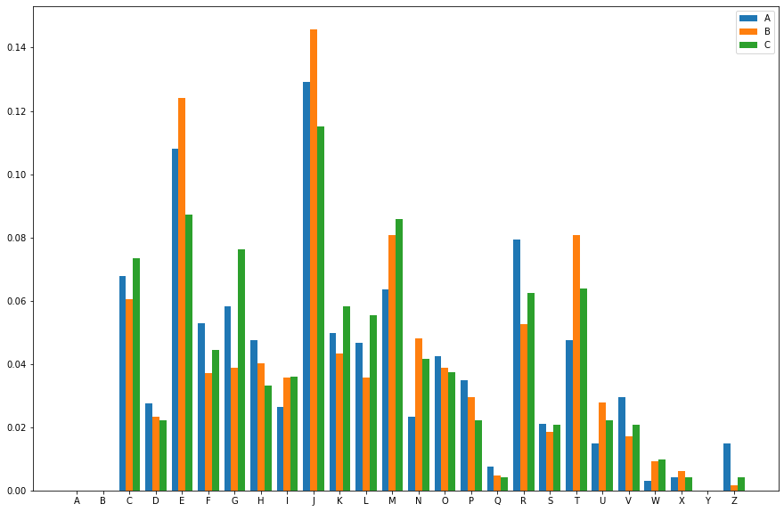
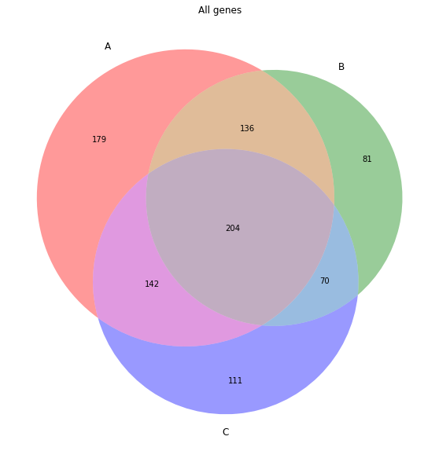
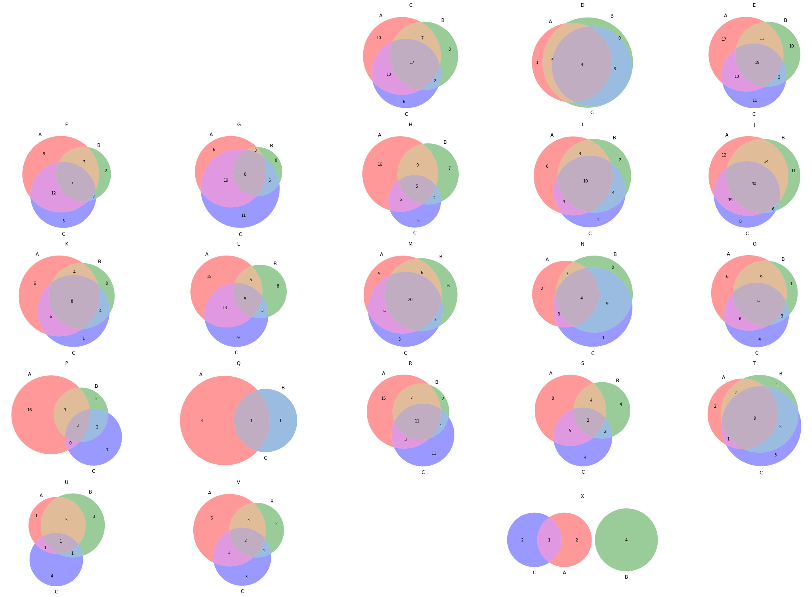
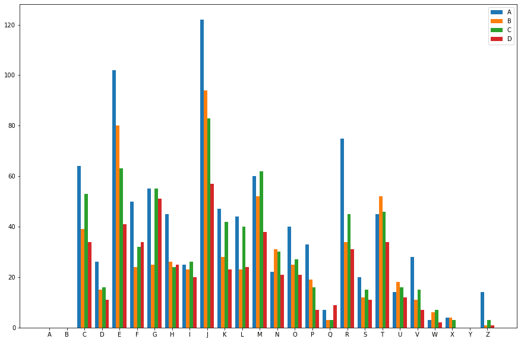
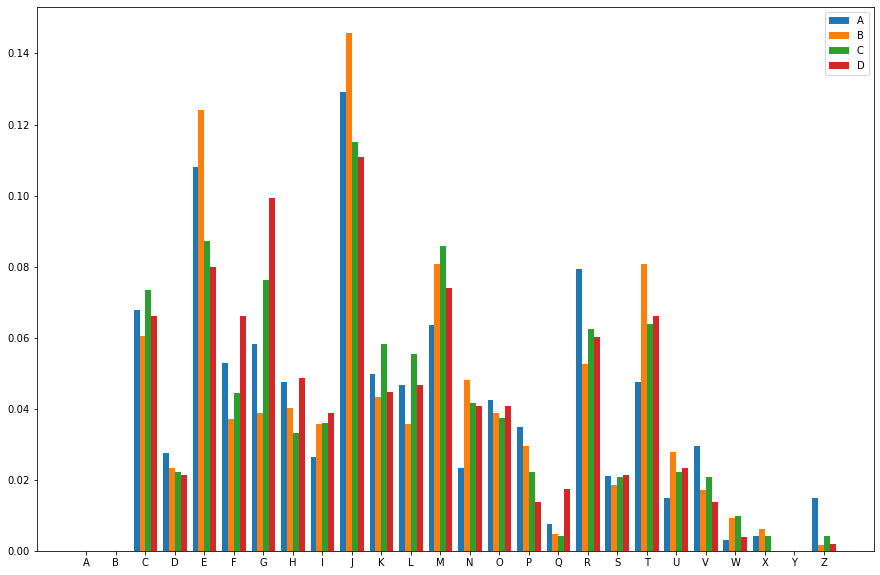
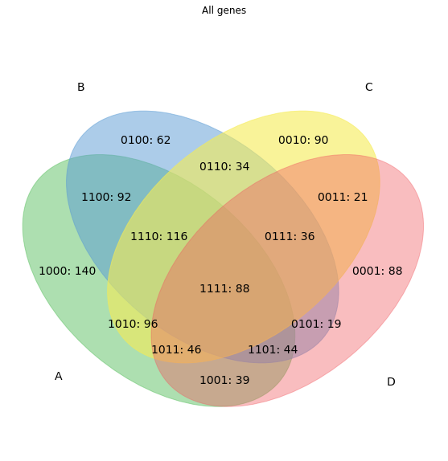
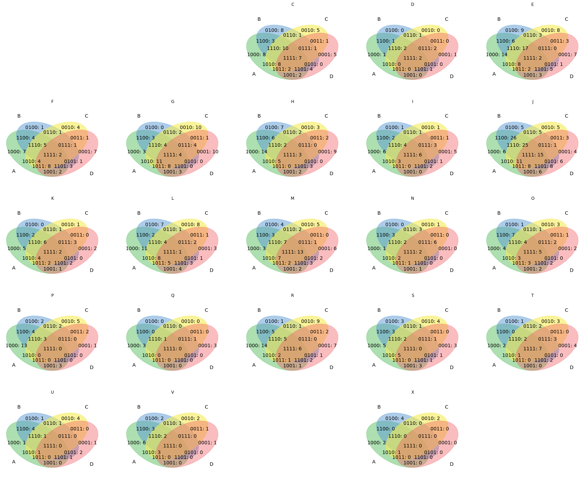
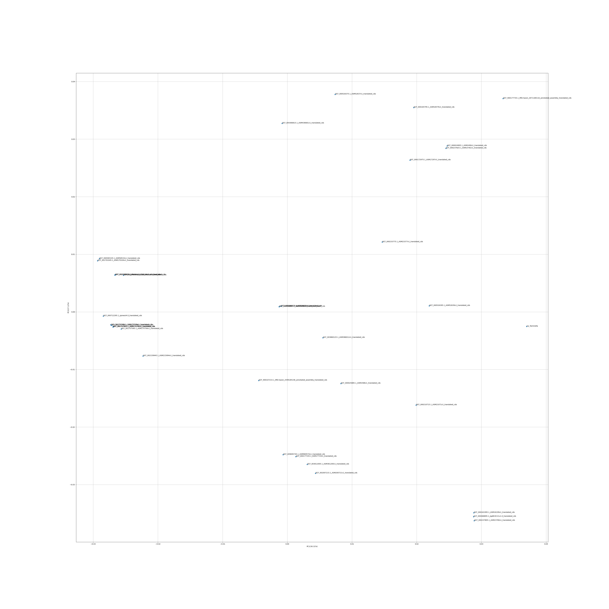
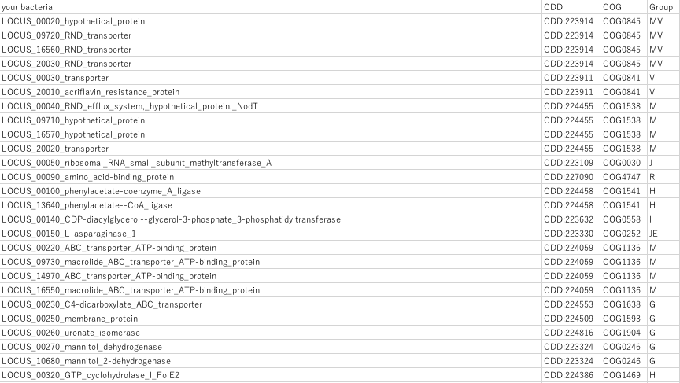

# COGplot
**遺伝子のアミノ酸データをCOG分類して棒グラフとベン図、PCAの図を出力するスクリプト**
- rpsblastを実行する際のe-valueは偽遺伝子がカウントされることを防ぐためにデフォルトの値を1e-25にしています。
  - contigの端にある遺伝子だけをCOG解析したいときは　-e オプションでe-valueを変更してください。
- ベン図を出力できる入力データ数の上限は6です。
- 入力データ数が４以上の場合はベン図の積集合の要素数とその面積は一致しません。
- PCAの入力にはCOG分類結果の比率データをCLR変換したものを使用しています。
- Shebangを追加しました

**依存**
- matplotlib-venn
## Installation
```
$ pip install matplotlib-venn
$ git clone https://github.com/dkato2021/COGplot.git
$ chmod u+x COGplot.py
```

## Usage
```
$ python3 COGplot.py -AA  [genes1.fasta [genes2.fasta ...]]

#rpsblastの結果を入力データとして扱いたい場合
$ python3 COGplot.py -rps  [genes1.txt [genes2.txt ...]]
```
## optional arguments
```
  -h, --help            show this help message and exit
  -rps [RPS [RPS ...]]  path to your results of rpsblast
  -AA [AA [AA ...]]     paths　to your amino acids files of genes(Venn diagram is not output if there are 6 or more files)
  -e EVALUE             evalue in rpsblast(default:1e-25)
  -s1 S1                graph size of venn diagrams(default:10)
  -s2 S2                graph size of PCA plot(default:10)
  -cogdb COGDB          path to your cogdb to run rpsblast(default:/home/tmp/db/COG/Cog)
  -cddid CDDID          path to your cddid_COG.tbl(default:/home/tmp/db/COG/cdd2cog/cddid_COG.tbl)
  -cog COG              path to your cog-20.def.tsv(default:/home/tmp/db/COG/cdd2cog/cog-20.def.tsv)
```
## 出力例











