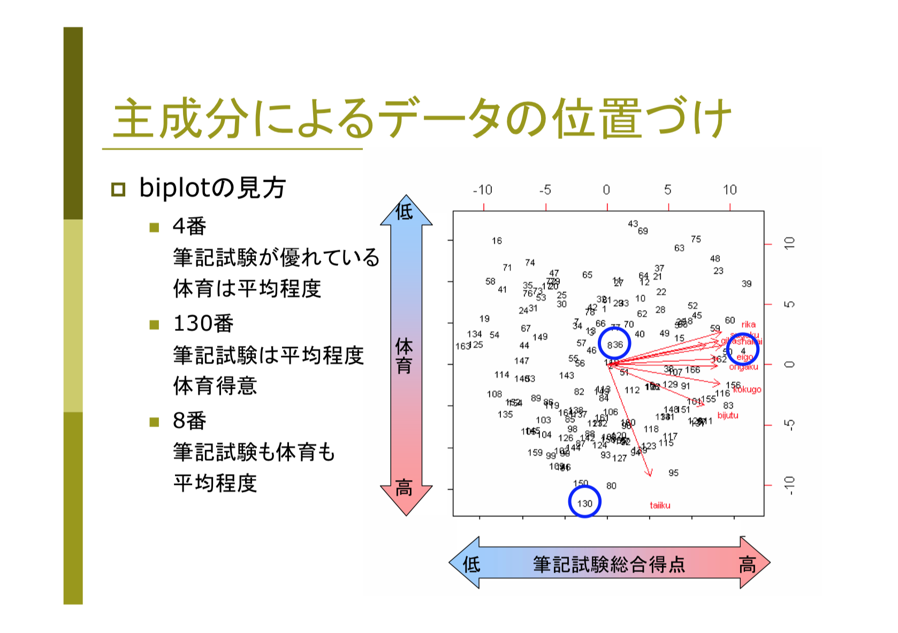

# COGplot
**遺伝子のアミノ酸配列データをCOG分類して棒グラフ、ベン図、PCAの図と固有遺伝子の一覧表を出力します**

**依存**
- matplotlib-venn
## Installation
```
$ pip install matplotlib-venn
$ git clone https://github.com/dkato2021/COGplot.git
$ chmod u+x COGplot.py
```
## Usage
```
$ COGplot.py -AA gene1.fasta gene2.fasta
```

## optional arguments
```
  -h, --help            show this help message and exit
  -AA [AA [AA ...]]     paths　to your amino acids files of genes(Venn diagram is not output if there are 6 or more files)
  -rps [RPS [RPS ...]]  path to your results of rpsblast
  -e EVALUE             evalue in rpsblast(default:1e-28)
  -bar BAR_SIZE         specify a integer value: graph size of bar plot(default:5)
  -B N_BLACK            Number of bars dyed in black in a bar graph(default:1)
  -PCA PCA_SIZE         specify a integer value: graph size of PCA plot(default:5)
  -G N_GREEN            Number of points dyed in green in a PCA plot(default:0)
  -venn VENN_SIZE       specify a integer value: graph size of venn diagrams(default:7)
  -cogdb COGDB          path to your cogdb to run rpsblast(default:/home/tmp/db/COG/Cog)
  -cddid CDDID          path to your cddid_COG.tbl(default:/home/tmp/db/COG/cdd2cog/cddid_COG.tbl)
  -cog COG              path to your cog-20.def.tsv(default:/home/tmp/db/COG/cdd2cog/cog-20.def.tsv)
```
## tips
```
$ COGplot.py -AA ./X/* ./Y/* -e 1e-4 1e-12 1e-20
```
## [図の見方](https://statistics.co.jp/reference/software_R/statR_9_principal.pdf)


参考文献
- https://statistics.co.jp/reference/software_R/statR_9_principal.pdf

## 出力例


