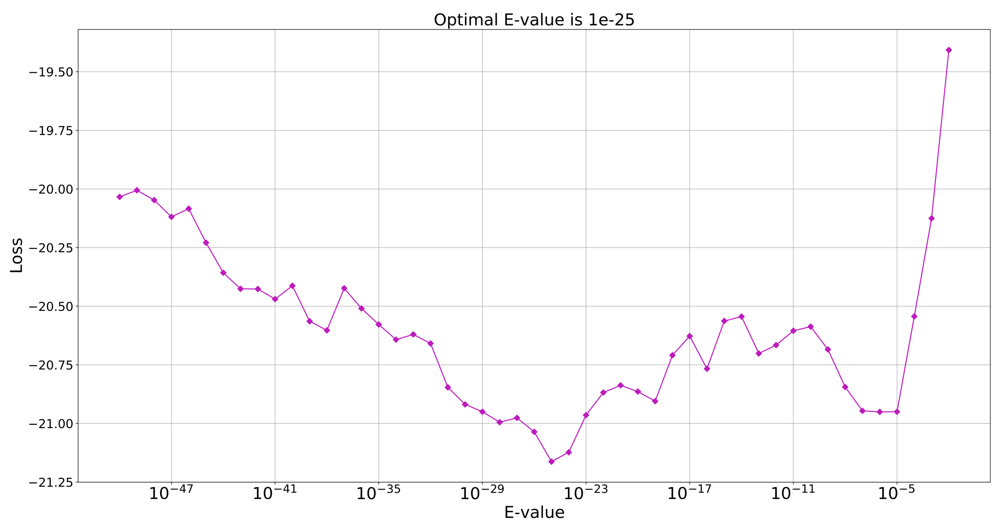

# COGplot
**dependency**
- matplotlib-venn  

## Installation
```
$ pip install matplotlib-venn
$ git clone https://github.com/dkato2021/COGplot.git
$ chmod u+x *.py
```
## Usage
```
$ Lossplot.py -AA gene1.fasta gene2.fasta ...
$ COGplot.py -AA gene1.fasta gene2.fasta ...
```


## optional arguments of Lossplot.py
```
optional arguments:
  -h, --help            show this help message and exit
  -AA [AA [AA ...]]  paths　to your amino acids files of genes
  -ratio RATIO       When you omit rpsblast, specify ./allPCA_ratio/ along with the csv option
  -csv CSV           When you omit rpsblast, specify LossGraph.csv along with the ratio option
  -t NUM_THREADS     num_threads(default:42)
  -l LOSS_SIZE       specify a integer value: graph size of loss graph(default:6)
  -p POINTS          number of points in loss graph
  -d DELTA           search interval of E-value(value 4 is recommended)
  -PCA PCA_SIZE      specify a integer value: graph size of PCA plot(default:5)
  -o N_ORANGE        Number of points dyed in orange in a PCA plot(default:0)
  -cogdb COGDB       path to your cogdb to run rpsblast(default:/home/tmp/db/COG/Cog)
  -cddid CDDID       path to your cddid_COG.tbl(default:/home/tmp/db/COG/cdd2cog/cddid_COG.tbl)
  -cog COG           path to your cog-20.def.tsv(default:/home/tmp/db/COG/cdd2cog/cog-20.def.tsv)
```
## optional arguments of COGplot.py
```
optional arguments:
  -h, --help            show this help message and exit
  -AA [AA [AA ...]]     paths　to your amino acids files of genes(Venn diagram is not output if there are 6 or more files)
  -rps [RPS [RPS ...]]  path to your results of rpsblast
  -e [EVALUE [EVALUE ...]] evalue in rpsblast(default:1e-)
  -bar BAR_SIZE         specify a integer value: graph size of bar plot(default:5)
  -b N_BLACK            Number of bars dyed in black in a bar graph(default:1)
  -PCA PCA_SIZE         specify a integer value: graph size of PCA plot(default:5)
  -o N_ORANGE           Number of points dyed in orange in a PCA plot(default:0)
  -venn VENN_SIZE       specify a integer value: graph size of venn diagrams(default:7)
  -u NUM_UNIQUE         Number of files to search for unique genes (number of files from the top)(default:1)
  -t NUM_THREADS        num_threads(default:4)
  -cogdb COGDB          path to your cogdb to run rpsblast(default:/home/tmp/db/COG/Cog)
  -cddid CDDID          path to your cddid_COG.tbl(default:/home/tmp/db/COG/cdd2cog/cddid_COG.tbl)
  -cog COG              path to your cog-20.def.tsv(default:/home/tmp/db/COG/cdd2cog/cog-20.def.tsv)
```
## tips
```
$ COGplot.py -AA ./X/* ./Y/* -e 1e-4 1e-12 1e-20
```
## How to determine the Evalue





## How to detect unique genes

## How to interpret the PCA diagram

Reference
- https://statistics.co.jp/reference/software_R/statR_9_principal.pdf
## Output Example


